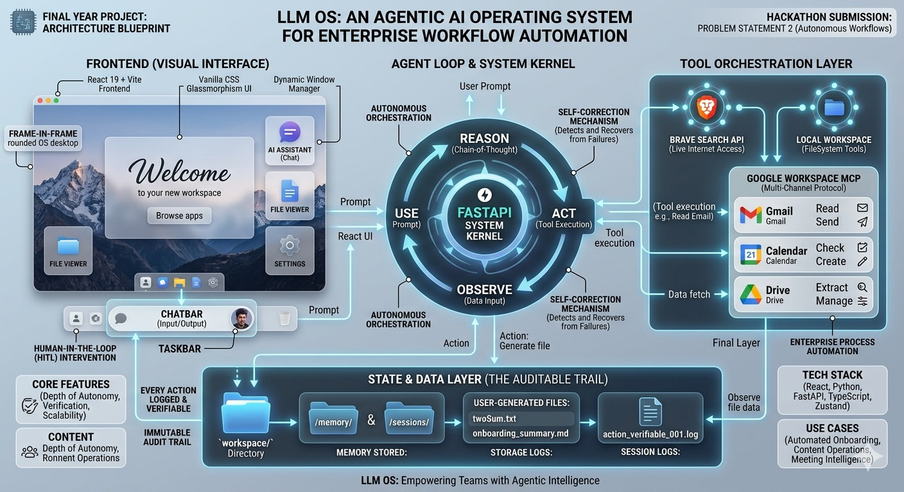

<div align="center">

# 🧠 LLM OS

### *The Operating System Where Language Is the Interface.*

[](https://python.org)
[](https://react.dev)
[](https://fastapi.tiangolo.com)
[](LICENSE)
[](docker-compose.yml)
[]()

**One prompt. Every tool. No context switching.**

[Quick Start](#-quick-start) · [Architecture](#-high-level-architecture) · [Features](#-key-features) · [Tech Stack](#-tech-stack) · [Use Cases](#-workflows--use-cases)


---

</div>



## 🔮 The Paradigm Shift

Traditional operating systems force *you* to learn each application's interface, manually drag data between tools, and burn cognitive energy on constant context switching. **LLM OS inverts this model entirely.**

A single natural-language prompt can read your Gmail, draft a reply, create a Google Calendar event, write a Python script, execute it, upload the output to the cloud, and message you the result on Telegram — all without you touching a single button between start and finish. **The LLM is the kernel. Language is the system call.**

This is not a chatbot wrapped in a desktop skin. It's a **complete operating-system architecture** — with a process scheduler (ReAct engine), hierarchical memory (RAM + Disk with automatic garbage collection), a peripheral bus (MCP + native tools), a window manager (Zustand), subagent multiprocessing, and a 10-channel I/O layer — built from the ground up around an LLM core. **Zero LangChain. Zero LangGraph. Pure control.**

---

## ✨ Key Features

| Feature | Description |
|:--------|:------------|
| **🧠 ReAct Reasoning Engine** | Custom multi-step tool-calling loop with up to **40 autonomous iterations** per request. The LLM reasons → acts → observes → adapts — until the task is done. No human in the loop. |
| **🗄️ 2-Tier Memory (RAM + Disk)** | **Session (RAM):** In-memory JSONL conversation history with a 100-message sliding window. **Disk:** LLM-consolidated long-term memory (`MEMORY.md`) + grep-searchable event log (`HISTORY.md`). **Automatic GC** compresses old messages when the window overflows. |
| **🔧 12+ Native Tools** | Filesystem R/W/Edit, shell execution (60s timeout + dangerous command blocking), web search (Brave API), web fetch (readability extraction), cloud sync (Supabase), cron scheduling, cross-channel messaging, and subagent spawning. |
| **🔌 MCP Peripheral Bus** | **Google Workspace integration** — Gmail, Calendar, Drive, and Tasks — via the Model Context Protocol. Supports stdio, SSE, and streamable HTTP transports. OAuth handled natively with auto-injection. |
| **🧭 ToolRouter (MMU)** | Domain-based context optimizer. Classifies each query → loads only relevant tools → keeps the context window lean. Critical for smaller, faster models. |
| **👥 Subagent Multiprocessing** | Spawn background agents for parallel task execution. Each subagent has its own tool registry and a 15-iteration budget. Results route back via the MessageBus. `/stop` cancels all active subagents. |
| **📡 10-Channel I/O** | Telegram, Discord, Slack, WhatsApp, Email (IMAP/SMTP), Feishu, DingTalk, Matrix, QQ, and the native REST API — all unified through a single async MessageBus. |
| **🖥️ Desktop Shell UI** | Full OS-like desktop environment: window manager, taskbar, file browser, embedded terminal, settings panel, and an AI chat bar — built in React 19 + TypeScript + Zustand 5. |
| **⏰ Cron Scheduler** | Schedule recurring tasks via natural language. The agent manages `jobs.json` and executes on schedule autonomously. |
| **☁️ Cloud Sync** | Upload workspace files to Supabase Storage with a single tool call. Returns a public URL instantly. |
| **🔄 Hot-Reload Config** | Change the LLM model, temperature, max tokens, or provider credentials at runtime via `POST /config/reload` — **zero restart required**. |
| **🧩 Skills System** | Extensible markdown-based skills with YAML frontmatter. Ships with GitHub, weather, summarizer, tmux, ClawHub, and skill-creator. Add your own or install from the registry. |
| **🔐 Security Hardened** | Path traversal protection, dangerous command pattern blocking (`rm -rf /`, fork bombs, `mkfs`), per-channel allow-lists, workspace sandboxing, API key masking, and localhost-only bridge binding. |
| **🛡️ Self-Correcting Execution** | Tool errors are caught, formatted with recovery hints, and re-injected into the reasoning loop. The LLM self-corrects on the next iteration — no human babysitting required. |

---

## 🎯 Workflows & Use Cases

### 1. 📧 The Meeting Follow-Up

**Single prompt:**
```
"Check my latest emails, summarize the top 3, draft a reply to the most
 urgent one, and create a follow-up task on my Google Tasks."
```

**What happens (zero intervention):**
1. Authenticates with Google via OAuth (MCP)
2. Searches Gmail → reads top messages → reasons about urgency
3. Drafts a contextual reply via Gmail compose
4. Creates a task on Google Tasks with a due date
5. Returns a formatted summary to you

> ⏱️ **Traditional workflow:** 4 apps, 12+ clicks, ~8 minutes.
> ⚡ **LLM OS:** 1 prompt, ~30 seconds.

---

### 2. 🔬 The Background Researcher

**Single prompt:**
```
"Spawn a subagent to research the top 5 competitors of Notion, write a
 comparison report as a markdown file, and upload it to the cloud."
```

**What happens:**
1. Main agent spawns a **background subagent** (independent ReAct loop, 15 iterations)
2. Subagent runs web searches → fetches pages → extracts data → writes `competitors.md`
3. Uploads the file to Supabase Storage → gets a public URL
4. Result is routed back to the main agent via the MessageBus
5. You get the summary + download link — while your main session stays free

---

### 3. ⏰ The Autonomous Scheduler

**Single prompt:**
```
"Every Monday at 9am, check my calendar for the week, summarize my
 meetings, and send me the digest on Telegram."
```

**What happens:**
1. Agent creates a cron job in `jobs.json`
2. Every Monday at 09:00, the cron service fires
3. Agent queries Google Calendar → builds a weekly digest
4. Sends the formatted summary to your Telegram via the MessageBus
5. Runs indefinitely — fully autonomous

---

## 🏗️ High-Level Architecture


```
┌──────────────────────────────────────────────────────────────────────┐
│                         LLM OS — User Space                         │
│  ┌──────────┐  ┌──────────┐  ┌──────────┐  ┌─────────────────────┐  │
│  │ Desktop  │  │ Terminal │  │ Settings │  │   File Viewer       │  │
│  │   (UI)   │  │  (xterm) │  │  (GUI)   │  │   (workspace)       │  │
│  └────┬─────┘  └────┬─────┘  └────┬─────┘  └─────────┬───────────┘  │
│       └──────────────┴─────────────┴──────────────────┘              │
│                        Window Manager (Zustand)                      │
│                          ↕ HTTP / REST API                           │
├──────────────────────────────────────────────────────────────────────┤
│                      LLM OS — Kernel Space                          │
│                                                                      │
│  ┌─────────────────────────────────────────────────────────────┐     │
│  │                    FastAPI Server Layer                      │     │
│  │      /execute  /health  /config  /workspace  /auth          │     │
│  └──────────────────────┬──────────────────────────────────────┘     │
│                         │                                            │
│  ┌──────────────────────▼──────────────────────────────────────┐     │
│  │                     MessageBus (IPC)                         │     │
│  │            Inbound Queue ←——→ Outbound Queue                 │     │
│  └──────────┬──────────────────────────────────┬───────────────┘     │
│             │                                  │                     │
│  ┌──────────▼──────────┐    ┌──────────────────▼──────────────┐     │
│  │    AgentLoop (CPU)  │    │     Outbound Dispatcher          │     │
│  │  ┌───────────────┐  │    │  Resolves per-request futures    │     │
│  │  │ ReAct Engine  │  │    │  Routes to: API / Telegram /     │     │
│  │  │ (40 iters max)│  │    │  Discord / Slack / Email / …     │     │
│  │  └───────┬───────┘  │    └──────────────────────────────────┘     │
│  │          │          │                                             │
│  │  ┌───────▼───────┐  │    ┌──────────────────────────────────┐    │
│  │  │  ToolRouter   │  │    │     Memory Architecture (MMU)     │    │
│  │  │  domain-based │  │    │  ┌─────────┐  ┌──────────────┐   │    │
│  │  │  filtering    │  │    │  │ Session  │  │ MemoryStore  │   │    │
│  │  └───────┬───────┘  │    │  │ (RAM)    │  │ (Disk)       │   │    │
│  │          │          │    │  │ JSONL    │  │ MEMORY.md    │   │    │
│  │  ┌───────▼───────┐  │    │  │ in-mem   │  │ HISTORY.md   │   │    │
│  │  │ Tool Registry │  │    │  └─────────┘  └──────────────┘   │    │
│  │  │ (Peripherals) │  │    └──────────────────────────────────┘    │
│  │  └───────────────┘  │                                            │
│  └─────────────────────┘    ┌──────────────────────────────────┐    │
│                             │   SubagentManager (Multicore)     │    │
│                             │   Background task execution       │    │
│  ┌──────────────────────────┴──────────────────────────────────┐    │
│  │                   Peripheral Bus (Tools)                      │    │
│  │  ┌──────┐ ┌──────┐ ┌──────┐ ┌──────┐ ┌──────┐ ┌───────────┐ │    │
│  │  │ FS   │ │Shell │ │ Web  │ │Cloud │ │ Cron │ │ MCP (GWS) │ │    │
│  │  │R/W/E │ │ Exec │ │Search│ │ Sync │ │ Jobs │ │Gmail/Cal/ │ │    │
│  │  │ Dir  │ │      │ │Fetch │ │Supa  │ │      │ │Drive/Task │ │    │
│  │  └──────┘ └──────┘ └──────┘ └──────┘ └──────┘ └───────────┘ │    │
│  └──────────────────────────────────────────────────────────────┘    │
└──────────────────────────────────────────────────────────────────────┘
```

**Data flow in one sentence:** User prompt → FastAPI → MessageBus inbound → AgentLoop builds context from memory + skills → ReAct loop calls tools via ToolRouter → final response → MessageBus outbound → resolved to the requesting channel.

---

## 🛠️ Tech Stack

| Layer | Technology |
|:------|:-----------|
| **LLM Runtime** | [LiteLLM](https://github.com/BerriAI/litellm) — multi-provider: Anthropic, OpenAI, Gemini, Groq, DeepSeek, Bedrock, 15+ providers |
| **Agent Core** | Custom ReAct loop (`nanobot v0.1.4`) — zero LangChain / LangGraph dependency |
| **API Server** | FastAPI 2.0 + Uvicorn (async ASGI) |
| **Message Bus** | Custom async `MessageBus` built on `asyncio.Queue` |
| **Memory** | JSONL session history + Markdown long-term memory + LLM-driven consolidation |
| **Tool Protocol** | Model Context Protocol (MCP) — stdio / SSE / streamable HTTP |
| **Cloud Storage** | Supabase Storage (file sync + public URLs) |
| **Frontend** | React 19 + TypeScript + Vite 6 + Zustand 5 |
| **Containerization** | Docker + docker-compose (Python 3.12 + Node.js 20) |
| **Google Workspace** | `workspace-mcp` — OAuth 2.0 for Gmail, Calendar, Drive, Tasks |
| **Search** | Brave Search API |
| **Embeddings** | Sentence Transformers + FAISS (tool routing) |

---

## 🚀 Quick Start

### Prerequisites

| Requirement | Version |
|:------------|:--------|
| Python | 3.11+ |
| Node.js | 18+ (for frontend + MCP servers) |
| LLM API Key | Gemini, Anthropic, OpenAI, Groq, or [any LiteLLM-supported provider](https://docs.litellm.ai/docs/providers) |

### 1. Clone the Repository

```bash
git clone https://github.com/your-org/llm-os.git
cd llm-os
```

### 2. Backend Setup

```bash
# Create and activate a virtual environment
python -m venv venv
source venv/bin/activate        # macOS / Linux
# venv\Scripts\activate         # Windows

# Install all dependencies
pip install -e .

# Copy the example config to the nanobot config directory
mkdir -p ~/.nanobot
cp config.example.json ~/.nanobot/config.json
```

Edit `~/.nanobot/config.json` — set your API key:

```json
{
  "providers": {
    "gemini": {
      "apiKey": "YOUR_GEMINI_API_KEY"
    }
  },
  "agents": {
    "defaults": {
      "model": "gemini/gemini-2.5-flash-lite",
      "maxToolIterations": 40,
      "memoryWindow": 100
    }
  }
}
```

### 3. Environment Variables

```bash
cp .env.example .env
```

Edit `.env` with your credentials:

```bash
# Google Workspace MCP (OAuth) — required for Gmail/Calendar/Drive/Tasks
GOOGLE_OAUTH_CLIENT_ID=your_client_id
GOOGLE_OAUTH_CLIENT_SECRET=your_client_secret
GOOGLE_OAUTH_REDIRECT_URI=http://localhost:8080/oauth2callback

# Supabase (Cloud Sync — optional)
SUPABASE_URL=https://your-project.supabase.co
SUPABASE_SERVICE_KEY=your_service_key
```

### 4. Local Authorization

```bash
python auth.py
```

This utility script is a necessary step to configure local development OAuth tokens and workspace authorization. It allows developers to securely test the system and perform authenticated actions without requiring a full production OAuth handshake.

### 5. Boot the Kernel

```bash
python server.py
```

```
✅ Server running at http://localhost:8000
✅ Health check:  GET http://localhost:8000/health
✅ API docs:      http://localhost:8000/docs
```

### 6. Launch the Frontend Shell

```bash
cd os_frontend
npm install
npm run dev
```

```
✅ Desktop UI at http://localhost:5173
```

### 7. Docker (Alternative)

```bash
docker-compose up -d nanobot-gateway
# Gateway available on port 18790
```

---

## ⚙️ Configuration & Extensibility

### Hot-Reload the LLM Config

Change model, temperature, or provider at runtime — no restart:

```bash
curl -X POST http://localhost:8000/config/reload
# → {"status": "reloaded", "changes": ["model → gemini/gemini-2.5-pro"]}
```

Or update via the API:

```bash
curl -X PUT http://localhost:8000/config \
  -H "Content-Type: application/json" \
  -d '{"patch": {"agents": {"defaults": {"model": "anthropic/claude-sonnet-4"}}}}'
```

### Add a New Native Tool

1. Create a new file in `nanobot/agent/tools/` (e.g., `my_tool.py`)
2. Subclass `Tool` from `base.py`
3. Implement `execute(**kwargs)` and `to_schema()` (OpenAI function-calling format)
4. Register it in `nanobot/agent/tools/__init__.py`

The tool is immediately available to the ReAct engine — no config changes needed.

### Use the Skills System

Skills are markdown-based capability extensions with YAML frontmatter:

```
nanobot/skills/
├── github/       # Interact with GitHub via gh CLI
├── weather/      # Weather info via wttr.in + Open-Meteo
├── summarize/    # Summarize URLs, files, YouTube videos
├── tmux/         # Remote-control tmux sessions
├── clawhub/      # Search & install skills from the registry
└── skill-creator/  # Create new skills interactively
```

Skills can be **always-active** or **loaded on-demand**. Requirements are auto-checked at boot.

### Connect an MCP Tool Server

Add external tool servers in `~/.nanobot/config.json`:

```json
{
  "tools": {
    "mcpServers": {
      "my-server": {
        "command": "npx",
        "args": ["-y", "@my-org/my-mcp-server"],
        "transport": "stdio"
      }
    }
  }
}
```

Supports `stdio`, `sse`, and `streamableHttp` transports.

---

## 📡 Supported I/O Channels

| Channel | Transport | Config Key |
|:--------|:----------|:-----------|
| **REST API** | HTTP POST `/execute` | Built-in |
| **React Desktop** | HTTP (via API) | Built-in |
| **Telegram** | Bot API | `channels.telegram` |
| **Discord** | Bot Gateway | `channels.discord` |
| **Slack** | Slack SDK | `channels.slack` |
| **WhatsApp** | Node.js bridge (localhost) | `channels.whatsapp` |
| **Email** | IMAP/SMTP | `channels.email` |
| **Feishu (Lark)** | Lark SDK | `channels.feishu` |
| **DingTalk** | Stream SDK | `channels.dingtalk` |
| **Matrix** | Matrix NIO | `channels.matrix` |
| **QQ** | QQ Bot SDK | `channels.qq` |

All channels route through the same `MessageBus` — the agent doesn't know or care which channel you're on.

---

## 🔐 Security

LLM OS ships with defense-in-depth security controls:

- **🛡️ Path Traversal Protection** — All file operations are sandboxed to the workspace
- **🚫 Dangerous Command Blocking** — `rm -rf /`, fork bombs, `mkfs.*`, raw disk writes are blocked
- **🔑 Per-Channel Allow-Lists** — Restrict access by user ID per channel
- **🔒 API Key Masking** — Sensitive keys are masked in all API responses
- **🏠 Localhost Bridge Binding** — WhatsApp bridge binds to `127.0.0.1` only
- **⏱️ Execution Timeouts** — Shell commands (60s), HTTP requests (30s), full pipeline (15min)
- **📁 Workspace Sandboxing** — Optional `restrictToWorkspace: true` for strict isolation

See [SECURITY.md](SECURITY.md) for the full policy, production deployment checklist, and incident response playbook.

---

## 📄 License

[MIT](LICENSE) — see the LICENSE file for details.

---

<div align="center">

**LLM OS** — *Your computer, understood.*

[⬆ Back to Top](#-llm-os)

</div>
