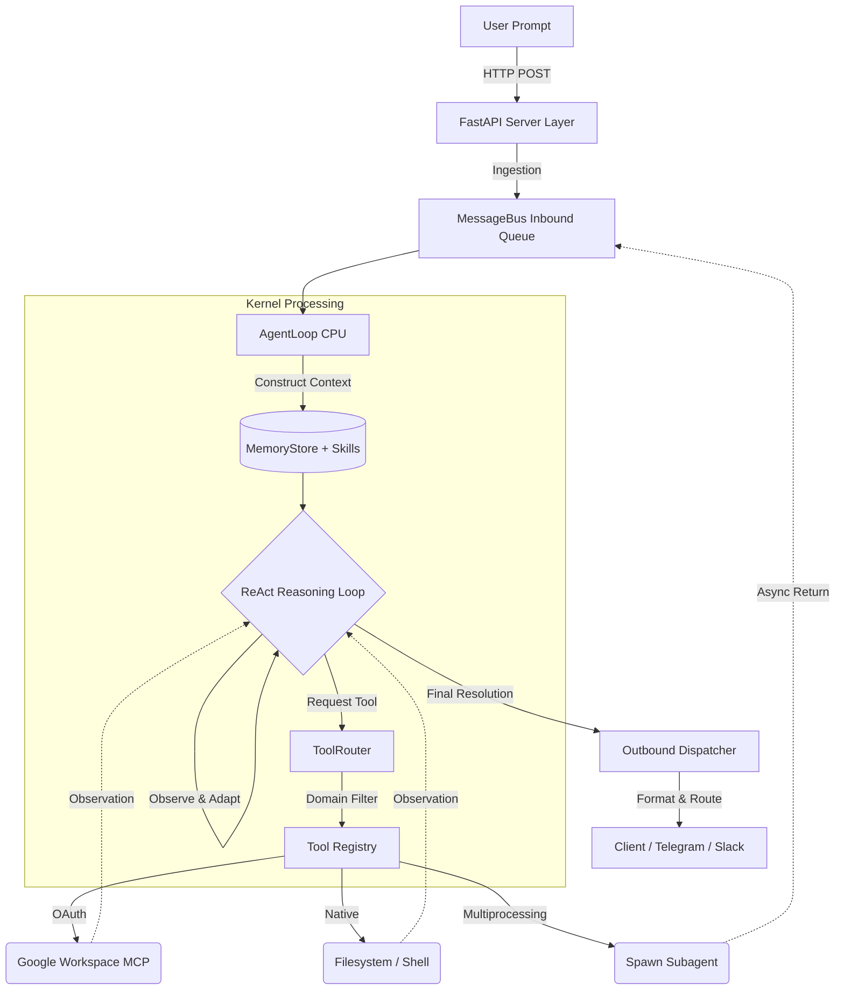

# LLM OS: The Operating System Where Language Is the Interface

## 1. Executive Summary
Traditional operating systems force human operators to act as the integration layer between disparate applications, burning cognitive energy on context switching and manual data transfer. **LLM OS** introduces a fundamental paradigm shift: **the LLM *is* the kernel, and natural language *is* the system call.** This is not a thin wrapper or a LangChain/LangGraph chatbot, but rather a custom-built, production-hardened agentic computational platform (`nanobot v0.1.4`) with zero LangChain/LangGraph dependency. By natively integrating a process scheduler (ReAct engine), hierarchical memory management (RAM+Disk), and a Model Context Protocol (MCP) peripheral bus, LLM OS completely abstracts the application layer, allowing a single prompt to autonomously orchestrate complex multi-app workflows.

## 2. System Architecture & Component Mapping
LLM OS maps classic operating system primitives directly to autonomous agent concepts, utilizing pure standard libraries and tailored routines for maximum systemic control.

| Traditional OS Concept | LLM OS Component | Module / File Focus |
| :--- | :--- | :--- |
| **CPU / Process Scheduler** | **AgentLoop** (`nanobot v0.1.4`) | ReAct reasoning engine; bounded 40-iteration optimization loop. |
| **IPC (Inter-Process Comm.)** | **MessageBus** (`asyncio.Queue`) | Async message routing unifying 10 disparate I/O channels. |
| **MMU (Memory Mgmt Unit)** | **ToolRouter & MemoryStore** | Sliding window JSONL (RAM) + `MEMORY.md` & `HISTORY.md` (Disk). |
| **Peripherals & Drivers** | **Peripheral Bus (MCP)** | `workspace-mcp`, native tools (`nanobot/agent/tools/`). |
| **Multiprocessing** | **SubagentManager** | Parallel background task spawning; independent tool registries. |
| **Kernel Space API** | **FastAPI Server Layer** | HTTP/REST bridging (`/execute`, `/config/reload`). |

## 3. Data & Process Flow (The Mermaid Diagram)

## 4. Evaluation Focus: Depth of Autonomy
Autonomous depth relies on independent traversal of logic spaces without requiring human guardrails. LLM OS is driven by a custom **40-iteration ReAct loop** that grants the agent 40 autonomous cycles to reason, act, observe, and adapt. 

**Exemplar Workflow (The Meeting Follow-Up):**
1. **Auth:** Natively handles OAuth handshakes via the Google Workspace MCP.
2. **Search & Read:** Queries Gmail for explicit threads; parses payloads dynamically.
3. **Reason:** Evaluates urgency and extraction requirements entirely in-memory.
4. **Draft:** Invokes Gmail routines to format and stage contextualized replies.
5. **Schedule:** Cross-references Google Calendar and deploys alerts to Google Tasks.

**Result:** A 5-stage, state-mutating sequence executing continuously from a single natural language command—zero intermediate clicks required.

## 5. Evaluation Focus: Quality of Error Recovery (Self-Correction)
System resilience relies on automated exception re-injection rather than fragile crashing. The `ToolRegistry` wraps all peripheral executions in isolating `try/except` boundaries.

If a tool fails, exception parameters are intercepted, formatted with strict recovery hints (e.g., *"Tool execute failed: Directory not found. Run 'ls' first"*), and injected directly back into the ReAct loop as an `Observation`. The LLM ingests the failure context and autonomously issues corrected system calls on the subsequent iteration.

| Threat / Failure Mode | LLM OS Hardened Mitigation |
| :--- | :--- |
| **LLM / Network Timeouts** | Shell execution limits (60s), request limits (30s), full pipeline kill-switch (15min). |
| **Malicious Shell Commands** | Regex-driven sandboxing blocking `rm -rf /`, fork bombs, `mkfs.*`, and disk writes. |
| **Context Window Overflow** | Automatic Garbage Collection (GC) compressing JSONL `RAM` state over 100 messages. |
| **MCP Server Crashes** | Isomorphic error formatting; context passed back as an "API Unavailable" observation. |

## 6. Evaluation Focus: Auditability of Decisions
Black-box agent behavior is unacceptable for enterprise platforms. LLM OS enforces strict architectural auditability via its localized 2-Tier Memory System.
* **`HISTORY.md` (System Logs):** An immutable, grep-searchable ledger recording every generated thought, tool invocation, and raw output parameter for explicit review.
* **`MEMORY.md` (State Consolidation):** LLM-consolidated persistent memory tracking long-term entity data.
* **Declarative Capabilities:** Extensible capabilities are defined via markdown skills containing strict **YAML frontmatter**. This creates a statically verifiable initialization list proving exactly what capabilities the kernel loaded into context at boot.

## 7. The Impact Model (Business Value)
We model conservative ROI for a generic knowledge-worker enterprise team (100 employees) leveraging the LLM OS Google Workspace MCP ecosystem.

* **Current State:** An employee executes ~10 cross-application operations daily (correlating data between Gmail, Calendar, Drive, and Tasks). Manual context switching costs roughly **20 minutes per day, per employee.**
* **Proposed State:** Utilizing the unified natural language OS, application abstraction drops operational execution time to **2 minutes per day, per employee.**
* **Time Saved:** 18 minutes/day × 100 employees = **1,800 minutes (30 hours) saved daily.**

**Annual Efficiency Gains (Assuming $50/hour fully burdened rate):**
* 30 hours/day × 250 working days = **7,500 hours saved annually.**
* 7,500 hours × $50/hour = **$375,000 hard ROI per 100 employees, per year.**

*Conclusion:* LLM OS reclaims stranded time, shifting the workforce from application maintenance to high-leverage strategic operations.
